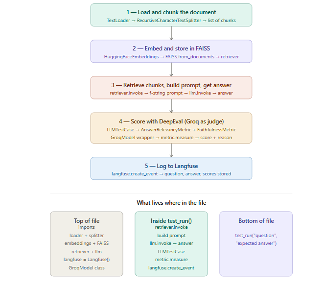

# RAG Evaluation Pipeline

A Retrieval-Augmented Generation (RAG) evaluation framework that tests LLM responses 
against a knowledge base using DeepEval metrics and logs results to Langfuse.

## What It Does

- Loads a document (company policy) and chunks it into a FAISS vector store
- Uses `llama3.2` via Ollama to generate answers from retrieved context
- Evaluates answers using 4 DeepEval metrics with a configurable judge model
- Logs all results (scores, latency, pass/fail) to Langfuse for observability



## Evaluation Metrics

| Metric | What It Checks |
|---|---|
| AnswerRelevancy | Did the LLM answer the actual question? |
| Faithfulness | Did the LLM stick to the retrieved context without hallucinating? |
| ContextualPrecision | Did the retriever rank the most useful chunks first? |
| ContextualRecall | Did the retriever fetch the chunk containing the answer? |

## Tech Stack

- **LLM** — Ollama (llama3.2)
- **Embeddings** — HuggingFace (all-MiniLM-L6-v2)
- **Vector Store** — FAISS
- **Evaluation** — DeepEval
- **Judge Model** — Groq (llama-3.3-70b) or Ollama (gemma4:26b)
- **Observability** — Langfuse

## Setup

1. Clone the repo
2. Install dependencies
```bash
   pip install -r requirements.txt
```
3. Copy `.env.example` to `.env` and add your keys
```bash
   cp .env.example .env
```
4. Run Ollama locally with llama3.2
```bash
   ollama pull llama3.2
```
5. Run the evaluation
```bash
   python app2.py
```

## Configuration

Switch judge model backend in `evaluation/deepeval_eval.py`:

```python
JUDGE_BACKEND = "groq"    # fast, API-based
JUDGE_BACKEND = "ollama"  # local, private
```

## Output

```
Question : How many annual leave days do employees get?
Expected : 25 days
Actual   : Employees get 25 days of annual leave.
Latency  : 1.14 seconds
Score    : 1.0
Result   : PASS

EVALUATION SUMMARY
Passed: 4/4
Success Rate: 100.0%
Average DeepEval Score: 1.0
```
